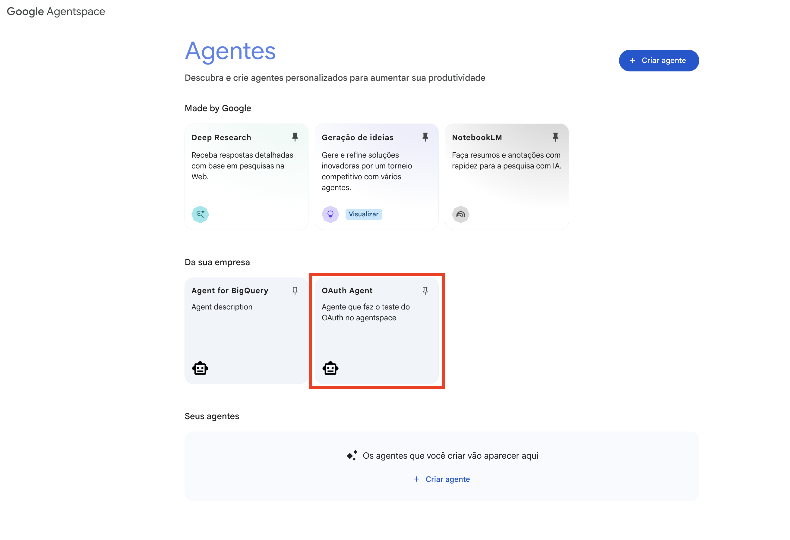

# Agente de Demonstração OAuth para AgentSpace

Este projeto é uma demonstração de como implementar e gerenciar um agente com autenticação OAuth 2.0 no ambiente do Google Cloud AgentSpace. O agente autentica o usuário, recupera suas informações básicas de perfil usando um token de acesso e exibe uma mensagem de boas-vindas.

O script principal (`agent/agent.py`) permite criar e deletar todos os recursos necessários de forma automatizada.

## Pré-requisitos

Antes de executar este agente, você deve ter o seguinte configurado:

1.  **Um Projeto no Google Cloud:** Garanta que você tenha um projeto no Google Cloud criado e as permissões necessárias para habilitar APIs e criar credenciais OAuth.
2.  **Tela de Consentimento OAuth 2.0:** Configure a tela de consentimento OAuth para o seu projeto no Console do Google Cloud.
3.  **ID do Cliente OAuth 2.0:** Crie um ID do Cliente OAuth 2.0 para uma "Aplicação Web". Você precisará do **Client ID** e do **Client Secret** para a configuração do ambiente.
4.  **Criar um App no AgentSpace:** Crie um aplicativo no AgentSpace (Vertex AI Search and Conversation). O nome deste aplicativo deve ser fornecido na variável `APP_NAME` no arquivo `.env`.

## Tutorial: Criando Credenciais OAuth 2.0

A seguir, um guia passo a passo para configurar a Tela de Consentimento OAuth e criar as credenciais necessárias no Google Cloud.

### Passo 1: Navegue até "APIs e Serviços"

No Console do Google Cloud, acesse o menu de navegação e selecione **"APIs e Serviços"**.


### Passo 2: Configure a Tela de Consentimento OAuth

No menu "APIs e Serviços", clique em **"Tela de consentimento OAuth"**. Configure-a selecionando o tipo de usuário (interno ou externo) e preenchendo as informações solicitadas, como nome do aplicativo e e-mail de suporte.


### Passo 3: Crie as Credenciais

1.  Após configurar a tela de consentimento, vá para a aba **"Credenciais"**.
2.  Clique em **"+ CRIAR CREDENCIAIS"** e selecione **"ID do cliente OAuth"**.


### Passo 4: Obtenha o Client ID e o Client Secret

1.  Selecione o **"Tipo de aplicativo"** como **"Aplicativo da Web"**.
2.  Em **"URIs de redirecionamento autorizados"**, clique em **"+ ADICIONAR URI"** e insira a seguinte URL: `https://vertexaisearch.cloud.google.com/oauth-redirect`.
3.  Clique em **"CRIAR"**. Uma janela pop-up aparecerá com o seu **Client ID** e **Client Secret**.
4.  Copie esses valores e cole-os nas variáveis `OAUTH_CLIENT_ID` e `OAUTH_CLIENT_SECRET` do seu arquivo `.env`.


## Configuração

Siga estes passos para configurar o projeto localmente.

1.  **Clonar o repositório (se aplicável):**
    ```bash
    git clone <url-do-repositorio>
    cd <diretorio-do-repositorio>
    ```

2.  **Criar o arquivo de ambiente:**
    Copie o arquivo de ambiente de exemplo para um novo arquivo `.env`.
    ```bash
    cp .env_example .env
    ```

3.  **Configurar suas variáveis de ambiente:**
    Abra o arquivo `.env` e preencha os valores com os detalhes específicos do seu projeto Google Cloud e credenciais OAuth.

    ```dotenv
    PROJECT_ID="seu-id-de-projeto-gcp"                  # ID do seu projeto no Google Cloud.
    PROJECT_NUMBER="seu-numero-de-projeto-gcp"          # Número do seu projeto no Google Cloud.
    LOCATION="sua-regiao-gcp"                           # Região onde os recursos da Vertex AI serão criados (ex: us-central1).
    STAGING_BUCKET="gs://seu-bucket-de-staging"         # Bucket no Cloud Storage para arquivos temporários da Vertex AI.
    MODEL="gemini-2.5-flash"                            # Modelo de linguagem a ser usado pelo agente.
    AUTH_ID="seu-id-de-autenticacao"                    # Um ID que você deve definir para identificar a configuração do OAuth.
    APP_REGION="global"                                 # Região do seu aplicativo no AgentSpace (geralmente "global").
    APP_NAME="seu-nome-de-app"                          # Nome do seu aplicativo criado no AgentSpace.
    OAUTH_CLIENT_ID="seu-id-de-cliente-oauth"           # Client ID obtido no Passo 4 do tutorial.
    OAUTH_CLIENT_SECRET="seu-segredo-de-cliente-oauth"  # Client Secret obtido no Passo 4 do tutorial.
    ```

4.  **Instalar dependências:**
    Os pacotes Python necessários estão listados no script `agent.py` e serão instalados automaticamente quando o agente for implantado. Para desenvolvimento local, pode ser necessário instalá-los manualmente:
    ```bash
    pip install google-cloud-aiplatform[adk,agent_engines] requests python-dotenv argparse
    ```

## Gerenciando o Agente

O script `agent/agent.py` é usado para criar e deletar todos os recursos associados ao agente.

### Para Criar o Agente

Para implantar o agente e criar as configurações necessárias no AgentSpace, execute o seguinte comando:

```bash
python agent.py --create
```

Este comando irá:
1.  Criar um `ReasoningEngine` na Vertex AI para o agente.
2.  Configurar as definições de OAuth no seu projeto Google Cloud.
3.  Criar o agente dentro do AgentSpace, vinculando-o ao `ReasoningEngine` e à configuração OAuth.

Após executar o script, você pode encontrar e interagir com o "OAuth Agent" na interface do AgentSpace do seu projeto.

## Interagindo com o Agente

A seguir, um exemplo do fluxo de interação de um usuário com o agente pela primeira vez.

### Passo 1: Encontrar o Agente

O "OAuth Agent" estará listado entre os agentes disponíveis no seu aplicativo do AgentSpace.



### Passo 2: Iniciar a Conversa e Autorizar

Ao iniciar a conversa, o agente solicitará a autorização. O usuário deve clicar no botão **"Autorizar"** para iniciar o fluxo de login do Google.


### Passo 3: Conceder Permissão

O usuário será redirecionado para a tela de consentimento padrão do Google, onde poderá revisar as permissões solicitadas e autorizar o acesso.


### Passo 4: Autenticação Bem-Sucedida

Após a autorização, o agente usará o token OAuth para buscar as informações do usuário e exibirá uma mensagem de boas-vindas personalizada, confirmando que o fluxo de autenticação foi concluído com sucesso.


### Para Deletar o Agente

Para remover completamente o agente e todos os seus recursos associados, execute:

```bash
python agent.py --delete
```

Este comando irá:
1.  Encontrar o agente "OAuth Agent" no AgentSpace.
2.  Deletar o agente do AgentSpace.
3.  Deletar a configuração de autorização OAuth.
4.  Deletar o `ReasoningEngine` associado da Vertex AI.
